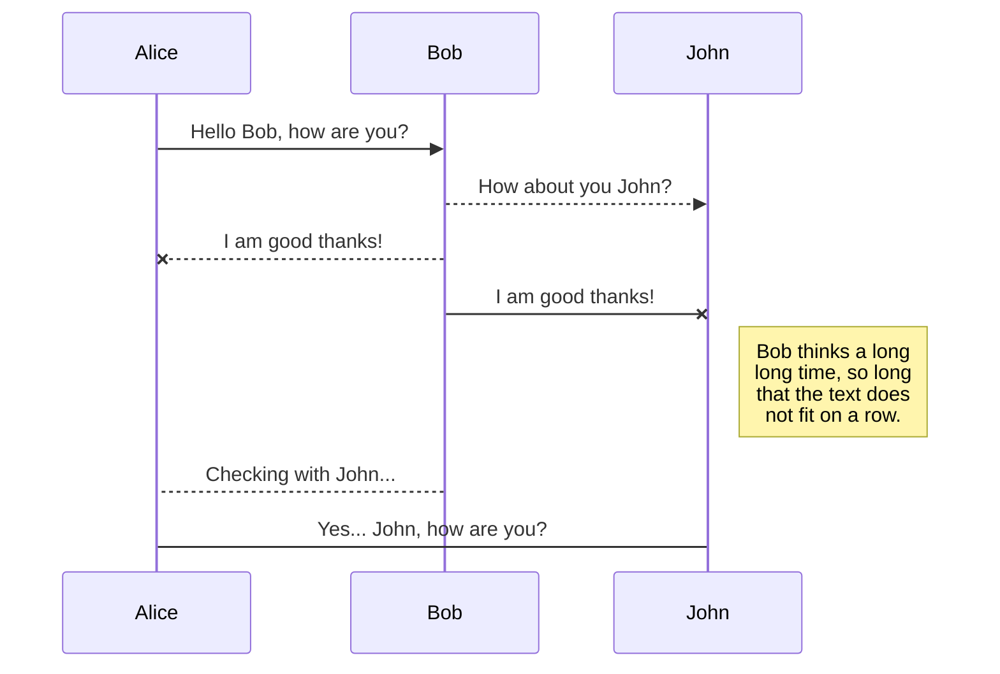
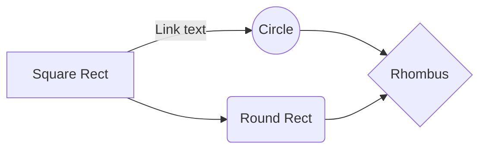

# StackEdit makes blogging in Markdown easy-peasy

**FastPages** supports blog posts in three file formats, including `.ipynb` for Jupyter, `.md` for Markdown and `.docx` for Microsoft Word. Each type of formats is supposed to be saved in a dedicated folder, respectively named `_notebooks`, `_posts`, and `_word` by **FastPages**. I've been using **Colab** to write posts in `.ipynb` because publishing them is as easy as saving them to **GitHub**. This can be done on **Colab** by doing:

> File >  Save a copy in GitHub

Then all you need to do is select your **FastPages** repo on **GitHub** and the `_notebooks` folder. 

But as for posts in `.md`, my workflow was not as smooth until I discovered [**StackEdit**](https://stackedit.io), which is an *in-browser Markdown editor*.  So this post shows how **StackEdit** makes blogging in Markdown easy-peasy.

## Add a workspace

Once you're on **StackEdit**, clicking on **START WRITING** is all that needs to be done to, umm..., start writing in Markdown. But   

## Testing Markdown extensions

### SmartyPants

SmartyPants converts ASCII punctuation characters into "smart" typographic punctuation HTML entities. For example:

|                |ASCII                          |HTML                         |
|----------------|-------------------------------|-----------------------------|
|Single backticks|`'Isn't this fun?'`            |'Isn't this fun?'            |
|Quotes          |`"Isn't this fun?"`            |"Isn't this fun?"            |
|Dashes          |`-- is en-dash, --- is em-dash`|-- is en-dash, --- is em-dash|

### KaTeX

You can render LaTeX mathematical expressions using [KaTeX](https://khan.github.io/KaTeX/):

The *Gamma function* satisfying $\Gamma(n) = (n-1)!\quad\forall n\in\mathbb N$ is via the Euler integral

$$
\Gamma(z) = \int_0^\infty t^{z-1}e^{-t}dt\,.
$$

> You can find more information about **LaTeX** mathematical expressions [here](http://meta.math.stackexchange.com/questions/5020/mathjax-basic-tutorial-and-quick-reference).

### UML diagrams

You can render UML diagrams using [Mermaid](https://mermaidjs.github.io/). For example, this will produce a sequence diagram:

And this will produce a flow chart:

## Recap

<!--stackedit_data:
eyJwcm9wZXJ0aWVzIjoidGl0bGU6IFN0YWNrRWRpdC10ZW1wbG
F0ZVxuZGF0ZTogMjAyMS0wNy0wMTdcbiIsImhpc3RvcnkiOlst
NzczNzI1MTU0LC0xOTMzOTczMjYzXX0=
-->